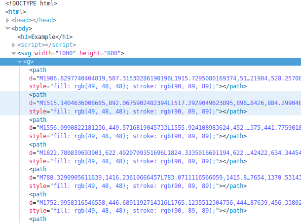
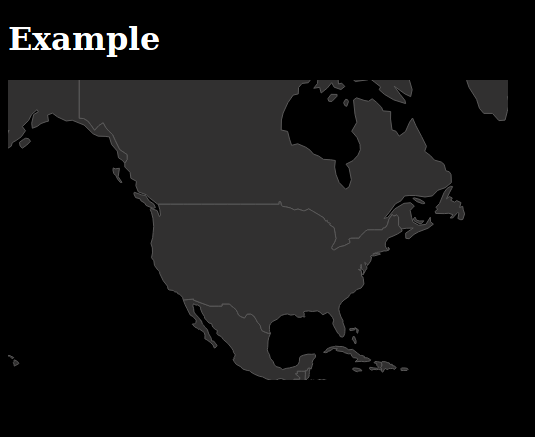

In D3 step 1 we will set up the basics to show a simple map with D3.

### Setting up the basics 

:arrow_forward: Open your text editor.

:arrow_forward: Start with a basic HTML page.

:arrow_forward: Save the file in a `yourDirectory` and call the file `index.html`.

``` html
<!doctype html>
<html>
	<head>
		<meta charset="utf-8">
		<title>basic HTML</title> 
	</head>
	<body>
		<h1>Example</h1>
	</body>
</html>
```

:arrow_forward: Go to [d3js.org](https://d3js.org/). Scroll down and download the newest release (`d3.v4.min.js`). Or use the snippet provided below. 

> Because we already have utf-8 stated in the `<head>` we do not have to specify it in the script. (utf-8 makes sure all diacritical marks are placed right)

``` html
<script src="https://d3js.org/d3.v4.min.js"></script>
```

> **JS** *JavaScript libraries are often placed in the head. Though, it is best to place them as far as possible to the bottom of the body. This is much quicker while loading!*

:arrow_forward: Change the title to “My first map in D3”. 

Now your file will look like:

``` html
<!doctype html>
<html lang="nl">
<html>
	<head>
		<meta charset="utf-8">
		<title>My first map in D3</title> 
	</head>
	<body>
		<H1>Example</H1>
		<script src="//d3js.org/d3.v4.min.js"></script> 
		<script> your code goes here </script>
	</body>
</html>
```
The basics are done! Let's start the code!

### Setting up the map canvas

:arrow_forward: Replace “your code goes here” with:

``` js
<script> 
	//Width and height
	var w = 500;
	var h = 300;

	//Define map projection
	var projection = d3.geoMercator()
		.center([ 30, 40 ])
		.translate([ w/2, h/2 ])
		.scale([ w/4 ]);

	//Define path generator
	var path = d3.geoPath()
		.projection(projection);

	//Create SVG
	var svg = d3.select("body")
		.append("svg")
		.attr("width", w)
		.attr("height", h);
</script>
```

> Some JavaScript explanation:
> 
> *The double slashes `//` mark a Single line comment. Any text between `//` and the end of the line will be ignored by JavaScript (will not be executed). > JavaScript comments can be used to explain JavaScript code, and to make it more readable.*
> 
> *The `;` at the end of every statement tells the computer that the statement has ended.*
> 
> `var` *stands for variable. Variables store data so that they can be used later on in the program.

What did you do?

:information_source: First you created to variables with the width and height of your map (named w and h) for your browser screen(in pixels). We need dimensions for the map, for we did not specify those in our css. 

``` js
//Width and height
var w = 500;
var h = 300;
```

:information_source: Next we created a variable projection which contains the projection specifications of the map. D3 procides a range of projections. We use Mercator here which is the most common.

:information_source: The `.centre` property we set with longitude and latitude. 

:information_source: `.translate`, in this way, takes care that our map is in the centre of the area.

:information_source: `.scale` is the zoom-level  

``` js
//Define map projection
var projection = d3.geoMercator()
	.center([30, 40])
	.translate([ w/2, h/2 ])
	.scale([ w/7 ]);
```

:information_source: When the projection is created we can use it to transform our geographic data to SVG with the help of `D3.geoPath` 

``` js
//Define path generator
var path = d3.geoPath()
	.projection(projection);
``` 

:information_source:  Next, we create our 'canvas' where we will display our map. You create a variable and give it a name, for example *svg*. 

:information_source:  `d3` is a call to the functions of D3. 

:information_source:`select`, selects one element of the DOM, in this case the `<body>`. 

:information_source: `append`, appends a SVG to the 'canvas' called *svg* 

:information_source:  next we also provide the `attr` (attributes), width and height.
	
``` js
//Create SVG
var svg = d3.select("body")
	.append("svg")
	.attr("width", w)
	.attr("height", h);
``` 


> Some JavaScript explanation:
> 
> JavaScript is an object based language. What we did here is creating several objects with properties and a property is an association between a name (or key) and a value. We can create objects and access their properties in the code.
> Objects in JavaScript, just as in many other programming languages, can be compared to objects in real life. The concept of objects in JavaScript can be understood with real life, tangible objects.

> For example, let's create an object named myCar and give it properties named make, model, and year as follows:
``` js
var myCar = new Object();
myCar.make = 'Ford';
myCar.model = 'Mustang';
myCar.year = 1969;
```
> It can also be written like this:

var myCar = new Object()
	.make = 'Ford'
	.model = 'Mustang'
	.year = 1969;

> Do you see the similarities with our code? Instead of creating an Object, we created a d3.geoMercator object!

``` js
var projection = d3.geoMercator()
	.center([30, 40])
	.translate([ w/2, h/2 ])
	.scale([ w/7 ]);
```
> You access the properties of an object with a simple dot-notation: ` objectName.propertyName`. So requesting the cars model would be:

```
myCar.model;
> 	'Ford'
```
> We also do this in our code! You will see this happening in the next parts. 


### Adding Data
To 'bind' your data to the DOM is the next step. With D3 you can connect data like .csv or in our case a GeoJSON file. We will use a GeoJSON with the country shapes of the whole world!

:arrow_forward: Download the world dataset from https://github.com/NieneB/Webmapping_for_beginners/tree/gh-pages/data

:arrow_forward: Place the world.geojson file in `yourDirectory`.

:arrow_forward: Copy the following script, below the previous script (index.html).

``` js
// create a new SVG group element
var layerWorld = svg.append('g');

//Load in GeoJSON data
d3.json("world.geojson", function(json) {
	//Bind data and create one path per GeoJSON feature
	layerWorld.selectAll("path")
		.data(json.features)
		.enter()
		.append("path")
		.attr("d", path);
}); 
```
:arrow_forward: Check in your browser if you see a world map.


What did you do?

:information_source: First we created a new variable called layerWorld which will keep all our data paths together in a group called 'g'.
:information_source: `d3.json( "world.geojson", function(json))` opens the GeoJSON file and puts the data through a function, the data will be called `json` inside the function.
:information_source: Now we select all "paths" in the layerWorld and create paths for every feature that we find in our data. `enter()` and `append()` will take care for this.
:information_source: The `.attr()` option creates the svg paths. 

If you open the console and look at the DOM instector you will see a `<path>` object is created per country! It wasn't in our HTML file first but D3 took care of that.





> ###  :bangbang: you do not see a map? 
> Open the debugger 
>
> * Click with your right mouse button, choose : `Inspect Element`
> * Or Press F12
> 
> The debugger shows you the content of your page. But also logs any errors or comments! 
> Go to the tab `Web Console` to see if it reports anything useful for you.
> 
> Do you get something like this:
> 
> `Uncaught SyntaxError: missing ) after argument list. index.html:19`
> 
> Then something is wrong in your code! This specific error means a `)` bracket is missing on line 19 of our script! 
> Try to fix your error and reload your page. 

:arrow_forward: Play around with the projection, centre and zoom level.

:arrow_forward: Have a look at https://github.com/d3/d3-3.x-api-reference/blob/master/Geo-Projections.md for different projections.

> Projection
> 
> Projections are what we call the mathematical equations that do the trick of turning the world into some flat shape that fits on a printout or a computer screen. It’s a messy task to do, this transformation - there’s no way to smoosh the world onto a screen without distorting it in some way. You either lose  direction, or relative size, or come out with something very weird looking.


:arrow_forward: For example, try to zoom in on the Netherlands or the US!

``` js
var projection = d3.geoMercator()
	.center([4, 52])
	.translate([ w/2, h/2 ])
	.scale(1000);
```

:arrow_forward: Now really try to pimp your map here! Change the colours and play around with the style attributes! 

For example, change the background of your web page to black, and give the world map another color, like dark grey:

``` html
<style type="text/css">
	body {
		background-color: #000000
	}
	h1 { 
		color: #ffffff
	}
</style>
``` 

Do you remember where to put is? 

This is for the countries:

``` js
.style("fill", "#313030")
.style("stroke", "#5a5959");
```
It should look something like this now:



This should be your code now: 

``` html
<!doctype html>
<html>
	<head>
		<meta charset="utf-8">
		<title>basic HTML</title> 
		<script src="https://d3js.org/d3.v4.min.js"></script>
		<style type="text/css">
			body {
				background-color: #000000
			}
			h1 { 
				color: #ffffff
			}
		</style>
	</head>
	<body>
		<h1>Example</h1>
		<script> 
			//Width and height
			var w = 1000;
			var h = 800;

			//Define map projection
			var projection = d3.geoMercator()
				.center([ -100, 45 ])
				.translate([ w/2, h/2 ])
				.scale([ w/2 ]);

			//Define path generator
			var path = d3.geoPath()
				.projection(projection);

			//Create SVG
			var svg = d3.select("body")
				.append("svg")
				.attr("width", w)
				.attr("height", h);

			// create a new SVG group element
			var layerWorld = svg.append('g');

			//Load in GeoJSON data
			d3.json("world.geojson", function(json) {
				//Bind data and create one path per GeoJSON feature
				layerWorld.selectAll("path")
					 .data(json.features)
					 .enter()
					 .append("path")
					 .attr("d", path)
					 .style("fill", "#313030")
					 .style("stroke", "#5a5959");
			}); 

			// create a new SVG group element
			var layerYeti = svg.append('g');

			//Call the geojson data
			d3.json("All_BFRO_Reports_points.geojson", function(data){
				
				//view the data
				console.log(data);

				//Create a circle for each city
				layerYeti.selectAll("circle")
					.data(data.features)
					.enter()
					.append("circle")
					.attr("cx", function(d) {
						//[0] returns the first coordinate (x) of the projected value
						return projection(d.geometry.coordinates)[0];
					})
					.attr("cy", function(d) {
						//[1] returns the second coordinate (y) of the projected value
						return projection(d.geometry.coordinates)[1];
					})
					.attr("r", 3)
					.style("fill", function(d){
						if (d.properties.styleUrl == "#a") {return "red"}
						else if (d.properties.styleUrl == "#b") {return "blue"}
						else { return "yellow"}
					})
					.style("opacity", 0.5);
			});
		</script>
	</body>
</html>
```

:arrow_right: Continue to [[D3 Step 2]]