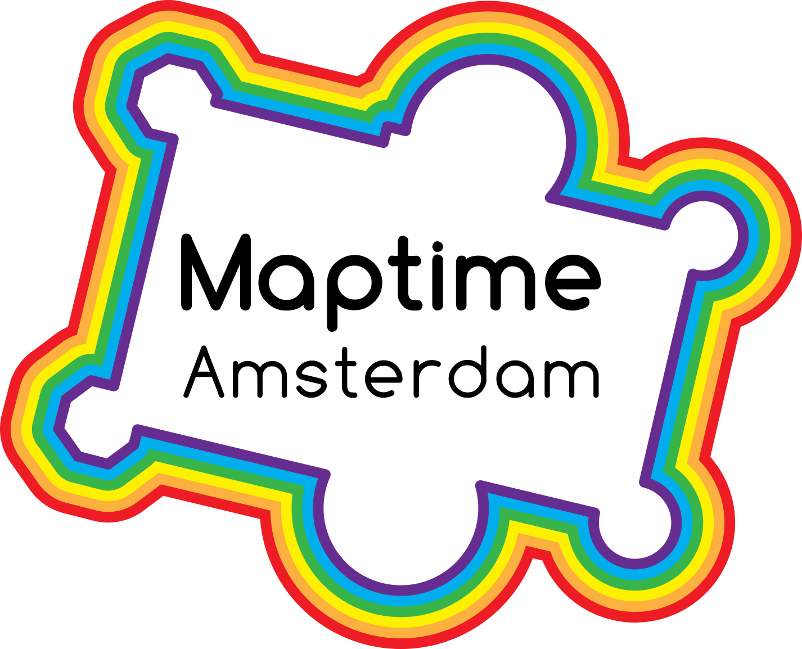

## Welcome to the workshop: Webmapping for beginners!

Maptime is hands on! 

The team from Webmapper developed this workshop in the context of Maptime to share their hands-on experience in web cartography and geographic web application development. 

JavaScript powers most on-line maps these days. During this workshop we'll cover the two primary mapping libraries D3.js and Leaflet.js.

We'll start off with an overview of some of the best maps of 2016 made with JavaScript, to give you an insight into the versatility of JavaScript for maps. Followed by a brief introduction into making web pages. To eventually spend most of our time on learning the tools of the trade.

## Short outline

1. HTML, CSS and JS
2. Leaflet.js Basics
2. Leaflet.js Advanced
2. D3.js Basics
2. D3.js Advanced
3. Hosting on Github

## Goal 

At the end of this workshop, you will have your own web page with an interactive map! Including some custom data and different background maps, zoomed in on the area you want to show! Your web page will be hosted on Github, so you can immediately share your progress of the day with all your family and friends!

## What do you need?

Your laptop with:

* a web browser, like Firefox, Chrome or Safari.
* a proper text editor, like [SublimeText](http://www.sublimetext.com/) or [Brackets](http://brackets.io/) with Syntax Hightlighting.
* a Github account. Create one at [www.github.com](www.github.com).
* internet.

**Start with reading the [[Introduction]]**