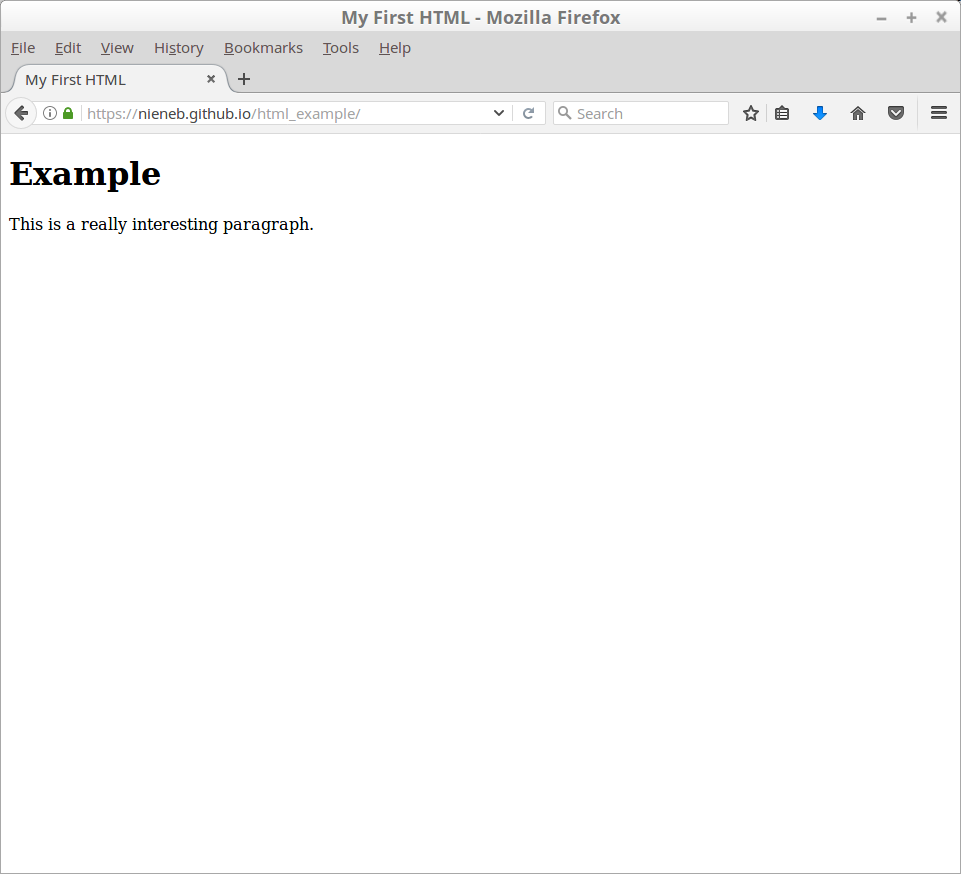
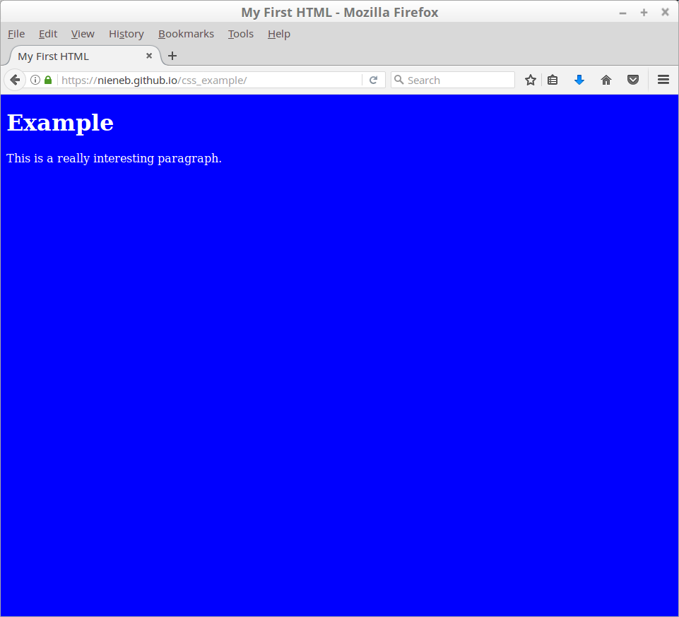

### Why learn HTML, CSS and JavaScript?

The 3 languages all web developers must learn:

1. HTML to define the content of web pages.
2. CSS to specify the layout of web pages.
3. JavaScript to program the behaviour of web pages.

Everything you see in a website is a result of the combination of HTML and CSS. With these two languages, you will have the skills you need to bring your website design to life! In order to make interactive web pages we will need to use JavaScript.

This tutorial is about the basics of HTML and CSS. JavaScript we will use immediately when implementing Leaflet! 

### HTML
HTML stands for Hyper Text Markup Language. It is used to give websites structure with text, links, images, and other fundamental elements. The simplest HTML page looks like this:

``` html
    <!DOCTYPE html>
    <html>
        <head>
            <title> My First HTML </title>
        </head>
        <body>
            <H1>Example</H1>
            <p>This is a really interesting paragraph.</p>
        </body>
    </html>
```

**Let's try this!**

 :arrow_forward: Open your text editor.

 :arrow_forward: Copy the previous code into an empty file to make your basic HTML page.

 :arrow_forward: Save the file in `yourDirectory` and call the file `index.html`.

 :arrow_forward: Open your index.html file with your browser.

[This](https://nieneb.github.io/html_example/) is what it should look like!



> ### Some basic elements to know and recognize are:
> 
> The `<head>` element is a container for all the head elements.
> The `<head>` element can include a title for the document, scripts, styles, meta information, and more.
> 
> The `<body>` tag defines the document's body.
> The `<body>` element contains all the contents of an HTML document, such as text, hyperlinks, images, tables, lists, etc.
> 
> `<h1></h1>` to `<h6></h6>` are headings. `<h1>` defines the most important heading. `<h6>` defines the least important heading.
> 
> The `<p></p>` tag defines a paragraph.
> 
> The`<div></div>` tag defines a division or a section in an HTML document.
> 
> The `<a href=""></a>`tag defines a hyperlink, which is used to link from one page to another.

 :arrow_forward: Try to add some more headers and text to your first HTML.

**But this webpage looks really boring!!** True, so let´s continue with CSS. 

### CSS

CSS stands for Cascading Style Sheets. It is used to style the visual appearance of HTML elements. Every element of your HTML can be styled with CSS.

A simple CSS stylesheet looks like this:

```css
    body {
        background-color: blue;
        color: white;
    }
```

CSS styles consist of selectors and rules. Selectors identify the specific elements of your HTML to which the styles rules will be applied. We connect selectors and rules using curly brackets. For example:

```css
    p {
        font-size: 12px;
        line-height: 14px;
        color: white;
    }
```

CSS rules can be included directly within the head of a document, like so:

```html
    <head>
        <style type="text/css">
            p {
                font-family: sans-serif;
                color: lime;
            }
        </style>
    </head>
```

or saved in an external file with a .css suffix, and then referenced in the document’s head:

```html
    <head>
        <link rel="stylesheet" href="style.css">
    </head>
```

**We will try this!**

 :arrow_forward: Copy this style code into your index.html page.

```html
    <style type="text/css">
        body {
            background-color: blue;
            color: white;
        },
        p {
            font-family: sans-serif;
            color: lime;
        }
    </style>
```

 :arrow_forward: Refresh your browser.

[This](https://nieneb.github.io/css_example/) is how it should look like.



 :arrow_forward: Play around with the CSS and HTML. Make yourself a nice page! 

On https://www.w3schools.com/css/ you can find a great overview of all the possibilities with CSS.


> ### Developer Tools
> 
> That sounds scary! But do not be afraid. The browser web inspector is going to be your best friend! Let's explore this. 
> 
>  :arrow_forward: In your browser when you opened your html 
>
> * Click with your right mouse button, choose : `Inspect Element`
> * Or Press F12
> 
> The web inspector shows you the content of your page and the current state of the DOM. DOM stands for Document Object Model and refers to the hierarchical structure of HTML. Web browsers parse the DOM in order to make sense of a page’s content.
> 
>  :arrow_forward: Do you see the same content as we just made in our text editor?
>
>  :arrow_forward: Just have a look around. Nothing can happen!
> 
> We will use the web inspector later again as a debugger, when your web-page doesn't show what you wanted it to! For now, you can close it again.


### JavaScript

JavaScript is a dynamic scripting language that can instruct the browser to make changes to a page after it has already loaded.

Scripts can be included directly in HTML, between two script tags:

```html
    <body>
        <script type="text/javascript">
            alert("Hello, world!");
        </script>
    </body>
```

Or stored in a separate file, and then referenced somewhere the HTML (commonly in the head):

```html
    <head>
        <title>Page Title</title>
        <script type="text/javascript" src="myscript.js"></script>
    </head>
```

We will learn JavaScript immediately when implementing Leaflet. Because we all came here to make interactive maps!

:arrow_right: **Continue to [[Leaflet Step 1]]**